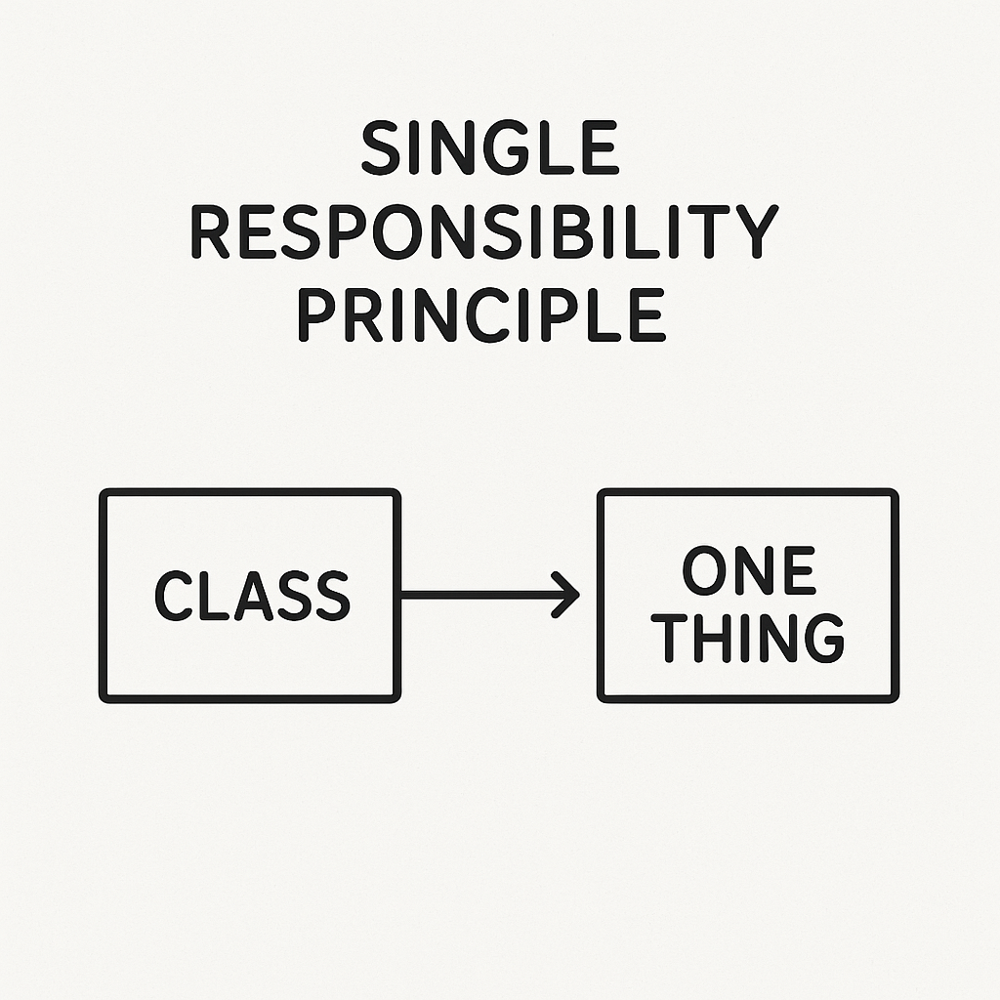
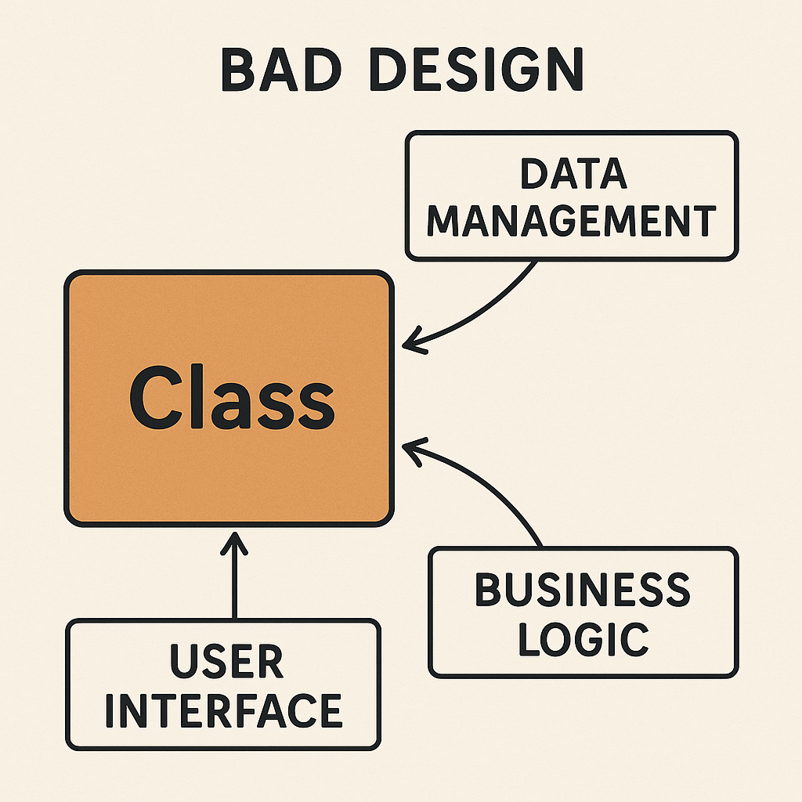

# Chapter 3: Single Responsibility Principle - Each class should have only one reason to change

## Description



The **Single Responsibility Principle (SRP)** is one of the fundamental principles of clean code and object-oriented design. It states that a class should have only one reason to change, meaning it should have only one job or responsibility. This principle is crucial for creating maintainable, testable, and flexible code.

### Why the Single Responsibility Principle Matters

When a class has multiple responsibilities, it becomes tightly coupled and harder to maintain. Changes to one responsibility can affect other parts of the class, leading to fragile code that breaks easily. By adhering to SRP, you create classes that are:

- **Easier to understand**: Each class has a clear, focused purpose
- **Easier to test**: Fewer responsibilities mean simpler unit tests
- **More maintainable**: Changes are isolated to specific areas of functionality
- **More reusable**: Single-purpose classes can be reused in different contexts
- **Less prone to bugs**: Fewer interdependencies reduce the risk of unintended side effects

### Example: Violating the Single Responsibility Principle

Consider this problematic class that handles multiple responsibilities:

```java
public class Employee {
    private String name;
    private double salary;
    
    public void calculatePay() {
        // Business logic for calculating pay
    }
    
    public void saveToDatabase() {
        // Database persistence logic
    }
    
    public void generateReport() {
        // Report generation logic
    }
    
    public void sendEmailNotification() {
        // Email sending logic
    }
}
```

This `Employee` class violates SRP because it has multiple reasons to change:
- Changes in pay calculation algorithms
- Changes in database schema or persistence technology
- Changes in report formatting requirements
- Changes in email system or notification requirements

### Example: Following the Single Responsibility Principle

Here's how we can refactor the code to follow SRP:

```java
public class Employee {
    private String name;
    private double salary;
    
    // Getters and setters only
}

public class PayCalculator {
    public double calculatePay(Employee employee) {
        // Business logic for calculating pay
    }
}

public class EmployeeRepository {
    public void save(Employee employee) {
        // Database persistence logic
    }
}

public class ReportGenerator {
    public String generateEmployeeReport(Employee employee) {
        // Report generation logic
    }
}

public class EmailNotificationService {
    public void sendNotification(Employee employee, String message) {
        // Email sending logic
    }
}
```

Now each class has a single, well-defined responsibility:
- `Employee`: Represents employee data
- `PayCalculator`: Handles pay calculation logic
- `EmployeeRepository`: Manages data persistence
- `ReportGenerator`: Creates reports
- `EmailNotificationService`: Handles notifications

### Key Benefits of This Refactoring

1. **Modularity**: Each component can be developed and tested independently
2. **Flexibility**: You can easily swap implementations (e.g., change from email to SMS notifications)
3. **Maintainability**: Changes to report formatting don't affect pay calculations
4. **Testability**: Each class can be unit tested in isolation
5. **Reusability**: The `EmailNotificationService` can be used for other entities besides employees

### Identifying Responsibilities

To identify if a class has multiple responsibilities, ask yourself:
- What are the different reasons this class might need to change?
- Can I describe what this class does in a single, clear sentence?
- Are there different groups of people (stakeholders) who might request changes to different parts of this class?

If you find multiple answers to these questions, it's likely time to split the class.



The Single Responsibility Principle is foundational to writing clean, maintainable code. By ensuring each class has only one reason to change, you create a codebase that is more robust, testable, and adaptable to future requirements.